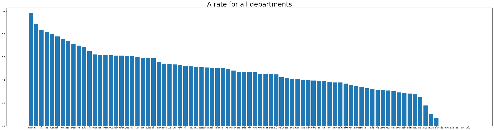

# Visualizing Grades

The goal of this project is to create a website that help visualize the grading distribution of some courses at UCSB. Please see the a visualization [on Github page of this repository](https://sir-teo.github.io/visualizing-grades/).

## How to Run Locally

For now, the visualization is made with d3.js, so to build yourself run

```
npm install d3
```

and 

```
npm install fuse.js
```

## Files

- `\notebook` contains the notebooks for analysis scripts
- `\grades2.csv` is the data
- `index.html` is the index page

## Exploratory Data Analysis

I tried to answer the some "big questions" like "Are there GPA inflations." with simple data analysis. To see the code that generate the graph, please see this [analysis page](https://sir-teo.github.io/visualizing-grades/analysis.html). 

To begin with, we define

$$
\text{A Rate} = \frac{\text{Number of people getting A's}}{\text{Total Number of People}}
$$

and 

$$
\text{Fail Rate} = \frac{\text{Number of people who fail}}{\text{Total Number of People}}
$$

### Which professor tend to give A's and Which tend to give fails

#### Professors who tend to give A's

| Professor Name     | A Rate |
| ----------- | ----------- |
| LUBACH D W      | 0.739       |
| GALLUCCI R | 0.722       |
|ABRA G J| 0.699|
|MCCARTY P C| 0.693|
|POPESCU P F| 0.651|
|BERENSTEIN D| 0.599|
|GORDON A F| 0.577|
|GARFIELD P M| 0.570|
|TYLER C M| 0.565|
|HILTNER K C| 0.548|

#### Professors who tend to give fails

| Professor Name     | Fail Rate |
| ----------- | ----------- |
|BRUICE P Y| 0.266|
|RICE W R| 0.240|
|AUE D H| 0.235|
|GAULIN S J| 0.230|
|FELDWINN D L| 0.224|
|AKEMANN C A| 0.216|
|KUNKEL B M| 0.208|
|JOSEPH C A| 0.206|
|LOW S H| 0.199|
|FRIDLUND A J| 0.181|
|RUPERT P| 0.173|

### What are the hardest courses/easiest courses?

#### Courses with high A rates

| Course Name     | A Rate |
| ----------- | ----------- |
|EEMB      2LL| 0.889|
|MCDB      1LL| 0.867|
|THTR      5| 0.820|
|CNCSP   101| 0.743|
|PHYS      3L| 0.742|
|PHYS      4L| 0.696|
|WRIT    107B| 0.679|
|PHYS      6BL| 0.629|
|MUS      15| 0.627|
|FEMST    20| 0.627|
|MUS      11| 0.622|

#### Courses with high fail rates

| Course Name     | Fail Rate |
| ----------- | ----------- |
|PSY       7| 0.236|
|CHEM    109B| 0.231|
|ANTH      5| 0.227|
|CHEM    109A| 0.227|
|CHEM      1A| 0.227|
|PSY       3| 0.226|
|EEMB      2| 0.214|
|PSTAT   120A| 0.206|
|ECON     10A| 0.202|
|MCDB      1A| 0.200|
|PSY       1| 0.199|

### How hard it is to get an A/ fail a course in a department?

#### A Rate by major



The top A rate majors are **Muisc Performance Laboratories**, **Military Science**, **German**, **Hebrew**, **Russian**, **Environmental Science and Management**.

#### Fail Rate by major


The top fail rate majors are **Astronomy**, **Math**, **Chemistry**, **MCDB**, **PSTAT**, **Psychology**, **EEMB**.

### Do GPA inflation exist at UCSB?

#### A rate by quarter


#### Fail rate by quarter


We see that there seem to be GPA inflation in the past 10 years. And the pandemic bumped the GPA a bit.